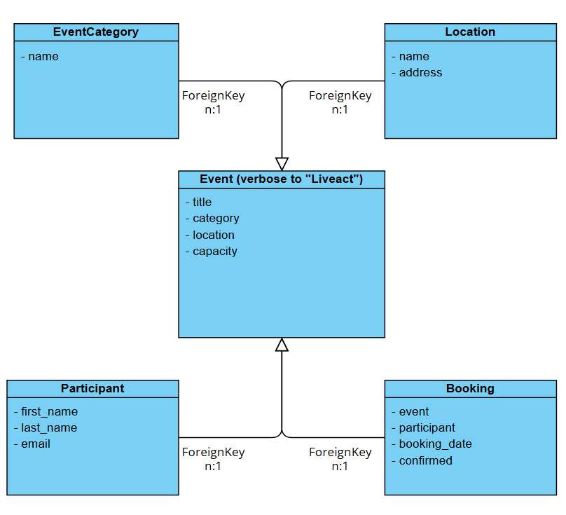

# Event Booking System (Django Admin)

A small backend learning project focused on working with the **Django Admin Interface**.
The project is built to practice relational data modeling and configuring a useful
administration UI without building a separate frontend.

All interaction happens through the Django Admin Panel.

## Goal

Practice backend fundamentals in a realistic but controlled setup:

### Backend (Django)

- Django project and app structure
- Relational database modeling
- ForeignKey relationships
- Admin model registration
- Admin list customization
- Search and filter functionality
- Form layout customization (fieldsets)
- Read-only fields
- Auto-generated fields
- Model metadata (verbose names, ordering)

## Tech Stack

### Backend

- Python
- Django
- SQLite (default Django database)

## Project Layout

```text
event_booking/
├─ core/ Django project (settings, urls, wsgi)
│
├─ events_app/ Events domain
│ ├─ migrations/
│ ├─ models.py
│ └─ admin.py
│
├─ bookings_app/ Booking domain
│ ├─ migrations/
│ ├─ models.py
│ └─ admin.py
│
├─ db.sqlite3
├─ manage.py
├─ requirements.txt
├─ docs/
│ └─ er_diagramm.png Screenshot for README
└─ README.md
```

## Backend Overview

The backend manages events, participants and bookings using relational models.

### Models

EventCategory

- name (string)

Location

- name (string)
- address (text)

Event (shown as "Liveact" in Admin)

- title (string)
- category (FK → EventCategory)
- location (FK → Location)
- date (datetime)
- capacity (positive integer)

Participant

- first_name (string)
- last_name (string)
- email (unique email)
- full_name (auto-generated)

Booking

- event (FK → Event)
- participant (FK → Participant)
- booking_date (auto set)
- confirmed (boolean)

Booking acts as a join table between Event and Participant with additional fields.

## Django Admin Features

### Event Admin

Custom list display (title, category, location, date)

- Search by title and date
- Filter by category
- Date hierarchy navigation

Form layout grouped using fieldsets:

- General
- Organization (collapsed)
- Default ordering by date
- Model renamed to "Liveact" in admin

### Booking Admin

- Filter by confirmed status
- booking_date displayed as read-only

### Participant Admin

- full_name auto-generated from first and last name
- full_name displayed as read-only
- Help texts on form fields

## Screenshot – Django Admin

Example view of the Event list in the Django Admin:


## Setup (Local Development)

### Prerequisites

- Python 3.x
- Optional: VS Code

Clone the repository

```text
git clone <YOUR_REPO_URL>
cd chat_app
```

## Backend Setup (Windows)

Open terminal in project root.

Create and activate virtual environment:

```text
python -m venv .venv
.venv\Scripts\activate
```

Upgrade pip and install dependencies:

```text
python -m pip install --upgrade pip
pip install -r requirements.txt
```

Run migrations:

```text
python manage.py makemigrations
python manage.py migrate
```

Create admin user:

```text
python manage.py createsuperuser
```

Start the backend:

```text
python manage.py runserver
```

Open in browser:
http://127.0.0.1:8000/admin/

## Backend Setup (macOS / Linux)

Open terminal in project root.

Create and activate virtual environment:

```text
python3 -m venv .venv
source .venv/bin/activate
```

Upgrade pip and install dependencies:

```text
python -m pip install --upgrade pip
pip install -r requirements.txt
```

Run migrations:

```text
python manage.py makemigrations
python manage.py migrate
```

Create admin user:

```text
python manage.py createsuperuser
```

Start the backend:

```text
python manage.py runserver
```

Open in browser:
http://127.0.0.1:8000/admin/

## Workflow in Admin

Recommended order when adding data:

1. Create Event Categories
2. Create Locations
3. Create Events (Liveacts)
4. Create Participants
5. Create Bookings

This ensures all ForeignKey relations are available.

## Notes

- This is a learning project focused on Django Admin usage
- No frontend is implemented
- No authentication logic beyond Django admin users
- No permissions or role management
- SQLite is used for simplicity
- Not intended for production use

License: Private learning project
